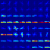
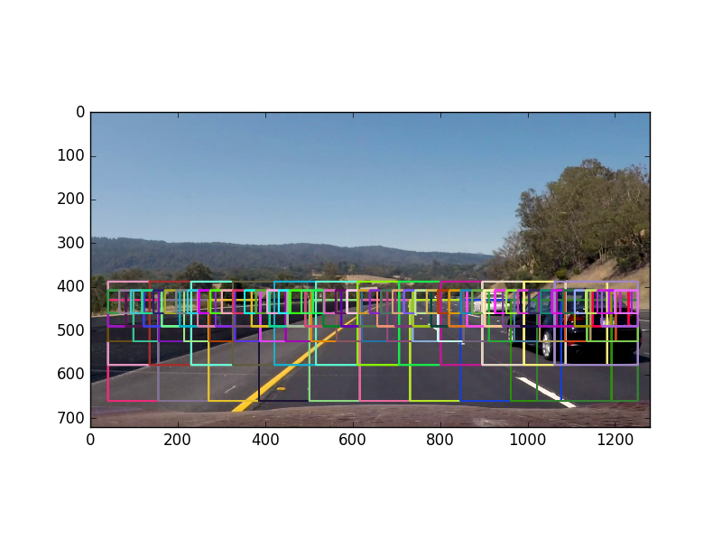
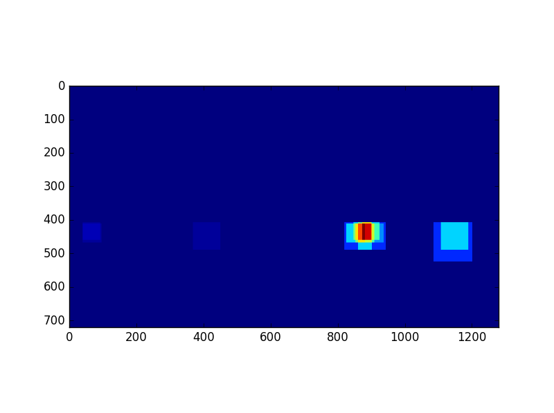

# Vehicle Detection

### About this document:

This document should be useful for anyone who would like to known more about project, or anyone who would like to understand pipline for robust vehicle detection from camera on mounted on a car.

The goals / steps of this project are the following:

* Perform a Histogram of Oriented Gradients (HOG) feature extraction on a labeled training set of images and train a classifier Linear SVM classifier
* Apply a color transform and append binned color features, as well as histograms of color, to your HOG feature vector. 
* Normalize features and randomize a selection for training and testing.
* Implement a sliding-window technique and use your trained classifier to search for vehicles in images.
* Run pipeline on a video stream and create a heat map of recurring detections frame by frame to reject outliers and follow detected vehicles.
* Estimate a bounding box for vehicles detected.

### Project requirements:

Project uses Python 3.5+ with libraries:
* openCV 3.0
* skit-learn

The Project
---

#### Result 
You can see result [video](result.mp4) in this repo. Or watch video on [youtube](https://youtu.be/1STnCs36MfU)

Brief desciption how to get this effect:

1) Train LinearSVC for two groups: Car and Non-car

2) Slide window on wide input image. If curent window was classified as a Car mark it on image

#### Data set
Data set was included in this [repo](train_data) .
This data set counts over 18000 pictures (64x64 RGB) of 2 groups: vehicles and everything else what can be found on the road but it's not a vehicle 
These example images come from a combination of the [GTI vehicle image database](http://www.gti.ssr.upm.es/data/Vehicle_database.html), the [KITTI vision benchmark suite](http://www.cvlibs.net/datasets/kitti/), and examples extracted from the project video itself.

Example images of cars:

Example images of non-cars:

#### Features extraction
In order to train [LinearSVC](http://scikit-learn.org/stable/modules/generated/sklearn.svm.LinearSVC.html) I had to extract features from images in data set, as images are not allowed directly as input for classifier.
However Linear SVC accepts long vectors. To get vectors from images I managed to extract:

* Histogram features of YCrCb Colorspace

* HOG features

* Spatial features

##### Colorspace

Durring testing best result vere given for YCrCb and HSL color spaces. In both of these color spaces value grows with luminance. And it make sense as cars are really like to be shiny
This color space was used to extract histogram of colors and as channels to calculate HOG

##### HOG features
HOG Features extraction can be found on function *get_hog_features()* in [train.py](train.py) file

I managed to use Histogram of Oriented Gradients (HOG) with fallowing parameters:

    colorspace = 'YCrCb'
    channels = 'ALL'
    orient = 12
    pix_per_cell = 8
    cell_per_block = 2

In order to get these features to by applicable in to SVC on the very end hog image was converted to vector by setting openCV Hog parameter *feature_vector* to True:
Chanells all means that function *get_hog_features()* was executed 3 times for every of YCrCb channel

        if hog_channel == 'ALL':
            hog_features = []
            for channel in range(feature_image.shape[2]):
                hog_features.append(get_hog_features(feature_image[:, :, channel],
                                                     orient, pix_per_cell, cell_per_block,
                                                     vis=False, feature_vec=True))
            hog_features = np.ravel(hog_features)

Values on first where set by intuition - what looks good (easy to see diference) on test images should also be good for SVC.
Later on during train process orient was shifted from 8 to 12 to maximalise train effect (from 99.02% to 99.58%)
These values gives me almost no false detection so it sound like good idea to use them

Results:
orignal/hog

It's quite easy to see, that cars have a lot of squares, while non cars have different shapes

### Training features
All 18k images were used to train SVC 
Images ver splited to the 2 gropus:
* vehicles
* non-vehicles

        car_images = glob.glob('train_data/vehicles/*/*.png')
        not_car_images = glob.glob('train_data/non-vehicles/*/*.png')
        cars = []
        notcars = []
        for image in car_images:
            cars.append(image)

        for image in not_car_images:
            notcars.append(image)

cars were given label = 1
non-car were given label = 0

    y = np.hstack((np.ones(len(car_features)), np.zeros(len(notcar_features))))

At the very end of data preparation of each train image in function *img_features(image)* in [train.py](train.py)
all features are combined together to the vector using numpy concatenate method

    np.concatenate((spatial_features, hist_features,hog_features))

All Dataset after extracting features (it about 1 minute on my i7 4700k @4.2Ghz) where mixed 20% to validation data nad 80% for train data:

    X_train, X_test, y_train, y_test = train_test_split(
        scaled_X, y, test_size=0.2, random_state=rand_state)

 It is very important to not forget to normalize dataset - trust me i lost really a lot of time because i forget to add this line:

     scaled_X = X_scaler.transform(X)

All train process can be fallowed in function *train_data()* in [train.py](train.py) file

Clasifier that was chosen was standard LinearSVC. It did a good job on default parameters. I tried to play a little with these parameters, but it is hard to go above 99.5% :]
No problems with overfiting with this data set.

    {'svc': LinearSVC(C=1.0, class_weight=None, dual=True, fit_intercept=True,
         intercept_scaling=1, loss='squared_hinge', max_iter=1000,
         multi_class='ovr', penalty='l2', random_state=None, tol=0.0001,
         verbose=0), 'spatial_size': (32, 32), 'cell_per_block': 2, 'scaler': StandardScaler(copy=True, with_mean=True, with_std=True), 'orient': 12, 'hist_bins': 32, 'pix_per_cell': 8}

Once classifier fited it was applied in sliding window on real road images

### Sliding window

Once SVC is trained we would like to scan the image with sliding window

[Resource](https://adioshun.gitbooks.io/learning-opencv-3-computer-vision-with-python/learning_python_opencv_ch07.html)

In this project to fit all areas where car can be found i managed to use 5 levels of sliding window for each of the distance scales (car appears smaller when it's far away), each level has 50% overlap for windows:

Level1 Near scale:

Level2 Mid near scale:

Level3 mid scale:

Level4 Mid far scale:

Level5 Far scale:

In the end all scales on one image. Remember! less windows better computing performance, but more chance to omit vehicles

Code for the slidind window can be found in [start.py](start.py) in function *slide_window(img, classifier, y_start, y_stop, x_start, x_stop, overlay,show_rectangles = False)*
At the very end when window positions are set sub image is cropped and features are extracted:

        subimg = img[y_top:y_bot,x_left:x_right,:]
        feature_img = cv2.resize(subimg, (64, 64))
        concentrated_features = train.img_features(feature_img)
        concentrated_features = X_scaler.transform(concentrated_features)
        sub_score = (classifier.predict(concentrated_features))
        if (sub_score[0] > 0):
            print("Found")
            boxes.append(bbox)

classifier and Xscaler are taken from previous step  once features were trained from all data set

Result of function on single image:

Sometimes (very rarly - LinearSVC did a great job) for one frame i had fase detections

Or on hard light conditions i had missed car in window for one or two frames.

In general i had very small amount of issues like false detections or no detections. That's because of selection of good feature vector for LinearSVC

However as shown on images above i had some problems:
Multiple single car detection, No detection, False Detection. I will deal with these problems in chapter - **Heatmap to reduce false detections**

There is more eficient alternative when HOG is calculated only once for whole image. More details in next chapter

####

### HOG optimalisation

As hog is very processing power consumming algorithm. it is really efficient aproach to calculet HOG once for the whole image, and later only reuse these values:

[resource: udacity.com]

    # Compute individual channel HOG features for the entire image
    hog1 = train.get_hog_features(ch1, orient, pix_per_cell, cell_per_block, feature_vec=False)
    hog2 = train.get_hog_features(ch2, orient, pix_per_cell, cell_per_block, feature_vec=False)
    hog3 = train.get_hog_features(ch3, orient, pix_per_cell, cell_per_block, feature_vec=False)
    

    (...) And later for sub images:
    
    hog_feat1 = hog1[ypos:ypos + nblocks_per_window, xpos:xpos + nblocks_per_window].ravel()
    hog_feat2 = hog2[ypos:ypos + nblocks_per_window, xpos:xpos + nblocks_per_window].ravel()
    hog_feat3 = hog3[ypos:ypos + nblocks_per_window, xpos:xpos + nblocks_per_window].ravel()
    hog_features = np.hstack((hog_feat1, hog_feat2, hog_feat3))

    test_features = X_scaler.transform(
                np.hstack((spatial_features, hist_features, hog_features)).reshape(1, -1))
                

### Heatmap to reduce false detections
I recorded the positions of positive detections in each frame of the video.  From the positive detections I created a heatmap and then thresholded that map to identify vehicle positions.  I then used `scipy.ndimage.measurements.label()` to identify individual blobs in the heatmap.  I then assumed each blob corresponded to a vehicle.  I constructed bounding boxes to cover the area of each blob detected.

Workflow to use

1. If car was found i added values to heatmap. Please see function add_heat in
2. Track last 6 frames and mark cars (**add_heat**) everytime car is found
3. Remove points with uncertain score (threshold < 2 was great for this video)
4. Label blobs
5. Draw boxes around certain areas

Presented above flow was coded below:

    heat = np.zeros_like(in_img[:, :, 0]).astype(np.float)
    heatmap = add_heat(heat,heat_boxes)
    cv2.imshow("heatmap", heatmap)
    heatmap = apply_threshold(heatmap, 2)
    heatmap = np.clip(heat, 0, 255)
    labels = label(heatmap)

    draw_img = draw_labeled_bboxes(np.copy(in_img), labels)

All functions used above can be found in [start.py](start.py)

Here's an example result showing the heatmap from a series of frames of video, the result of `scipy.ndimage.measurements.label()` and the bounding boxes then overlaid on the last frame of video:

Heatmap:

As we can see there is small false detection on the left part of image however thanks to the threshold it has beed rejected, because it appeard only for single frame

Result:

Previous:
Just for comparision what we would see without heatmap filter

### Video Pipline
In order to record video steps were given:

1. Convert `project_video.mp4` to series of images
2. Load images one by one
3. Apply sliding window to look for the cars
4. Save found cars into history data
5. Generate heatmap from historic data
6. Apply labeled data on image
7. Save image with id
8. Convert series of images to video

ffmpeg commands used:

    #video to images:
    ffmpeg -i "project_video.mp4" "frames/project_video/out-%04d.png"
    #images to video:
    ffmpeg -r 24 -f image2  -i frame-%04d.jpg -vcodec libx264 -crf 25  -pix_fmt yuv420p test.mp4

### Conclusion

Provided pipline allows to detect cars on he road quite robust. Hovever this system works fine only on this video. More adjustment and training data should be provided to make it general use vehicle tracking system.
Also because of using heat maps we can loose cars that moving very fast. For example to detect cars moving on the oposite direction 120km/h + 120km/h would need to use higher camera framerates and position prediction (Kalman filter for example)
Using HOG demands buffy CPU to run it on real time. But there are some walkoraund like using GPU computing or even FPGA solution to preprocess image. Also python is not the most efficient language.
So writting proper code on FPGA with and later use adavantages from GPU processing could improve process time dramaticly . Great paper can be found [HERE](http://www2.imse-cnm.csic.es/mondego/WASC2013/bourrasset_maggiani_wasc2013.pdf)
